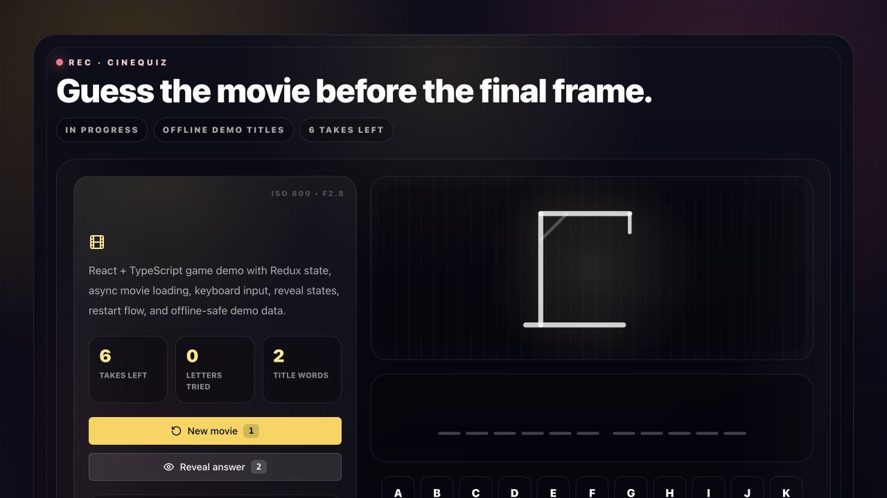
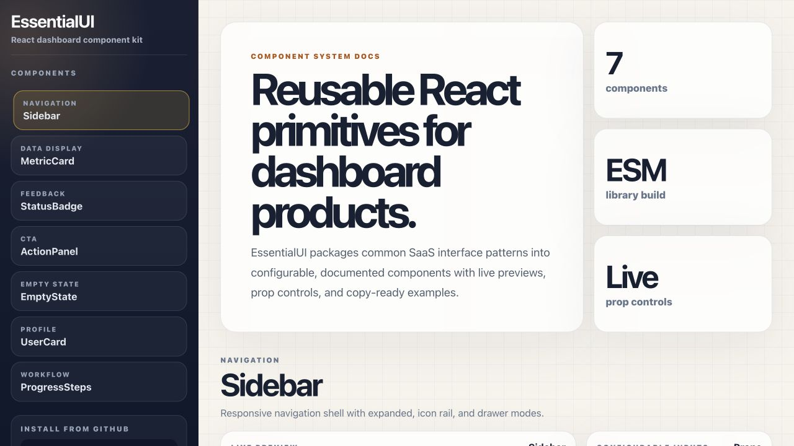

<h1 align="center">Maninderjit Johar</h1>

  <strong>Full-Stack Developer · Product Engineer · UI Systems Builder</strong> 
  I turn complex product requirements into fast, scalable, and intuitive web experiences.

  
  
  

  
  
  

---

## Impact, not just output

<table>
  <tr>
    <td align="center"><strong>↑ 30%</strong> customer satisfaction</td>
    <td align="center"><strong>↓ 25%</strong> scheduling errors</td>
    <td align="center"><strong>↑ 23%</strong> sales in two months</td>
    <td align="center"><strong>↑ 20%</strong> feature rollout speed</td>
  </tr>
  <tr>
    <td align="center"><strong>97%</strong> object-detection accuracy</td>
    <td align="center"><strong>↑ 15%</strong> team productivity</td>
    <td align="center"><strong>7+ years</strong> professional experience</td>
    <td align="center"><strong>B.Eng.</strong> engineering foundation</td>
  </tr>
</table>

I bring an engineering mindset to the entire product surface: accessible React interfaces, reusable component systems, APIs, databases, cloud services, and deployment. My best work happens where product thinking, technical quality, and measurable business outcomes meet.

## What I bring

<table>
  <tr>
    <td width="33%" valign="top">
      <strong>Product-minded delivery</strong> 
      I connect engineering choices to customer experience, operational reliability, and measurable business outcomes.
    </td>
    <td width="33%" valign="top">
      <strong>Modern frontend depth</strong> 
      React, TypeScript, component architecture, responsive UI, state management, accessibility, and polished user flows.
    </td>
    <td width="33%" valign="top">
      <strong>Full-stack ownership</strong> 
      APIs, data models, cloud services, deployments, debugging, code review, and mentoring across the delivery lifecycle.
    </td>
  </tr>
</table>

## Experience highlights

### Full-Stack Developer · Aerialytic

- Rejoined Aerialytic after a previous frontend role and expanded into full-stack product engineering, contributing across a **100+ project solar SaaS ecosystem**.
- Delivered **10+ Next.js and React applications** for lead capture, customer workflows, proposals, admin operations, and partner-facing experiences.
- Modularized CRM capabilities into embeddable partner-ready experiences using secure sessions, configuration-driven flows, and reusable integration patterns.
- Implemented REST and GraphQL workflows across **15+ backend services** for solar design, production modeling, savings calculations, lead management, and proposal generation.
- Strengthened product reliability with **100+ Python unit/integration tests**, golden-test scenarios, Jest, and Playwright coverage across API, UI, and calculation-heavy workflows.
- Containerized and deployed applications and services with Docker, Kubernetes, GitHub Actions, and GitOps workflows to support reliable multi-environment releases.

### Full-Stack Developer · MarketBox

- Redesigned the booking flow and consolidated scheduling experiences, contributing to **30% higher customer satisfaction**, **25% fewer scheduling errors**, and a **23% sales increase within two months**.
- Mentored junior developers in clean-code practices, helping improve team productivity by **15%**.
- Worked across the product stack to ship customer-facing workflows for a fast-moving SaaS environment.

### Frontend Developer · Aerialytic

- Improved feature rollout speed by **20%** and helped increase object-detection accuracy to **97%**.
- Built scalable data-visualization experiences for solar-energy applications.
- Partnered across engineering disciplines to maintain reliable experiences across devices.

## Featured engineering work

  Selected public work that shows product thinking, frontend craft, full-stack implementation, and reusable system design.

<table>
  <tr>
    <td width="50%" valign="top">
      
      <h3><a href="https://maninderjit-johar.github.io/cinequiz/">CineQuiz</a></h3>
      
A cinematic movie-title guessing game with async title loading, Redux-powered game state, keyboard shortcuts, reveal flow, and success/failure animations.

      
<strong>Links:</strong> <a href="https://maninderjit-johar.github.io/cinequiz/">Live demo</a> · <a href="https://github.com/maninderjit-johar/cinequiz">Source</a>

      
<strong>Engineering signals:</strong> typed Redux hooks, async state, offline-safe fallback data, reusable Radix primitives, responsive Tailwind UI, production build workflow.

      
<code>React</code> <code>TypeScript</code> <code>Redux Toolkit</code> <code>Radix UI</code> <code>Vite</code>

    </td>
    <td width="50%" valign="top">
      
      <h3><a href="https://maninderjit-johar.github.io/essentialui/">EssentialUI</a></h3>
      
A package-ready React dashboard component kit with reusable Sidebar, MetricCard, StatusBadge, EmptyState, UserCard, ProgressSteps, and ActionPanel components.

      
<strong>Links:</strong> <a href="https://maninderjit-johar.github.io/essentialui/">Live demo</a> · <a href="https://github.com/maninderjit-johar/essentialui">Source</a>

      
<strong>Engineering signals:</strong> package-ready ESM/UMD builds, component docs playground, configurable props, responsive behavior, reusable public exports.

      
<code>React</code> <code>JavaScript</code> <code>Vite Library Mode</code> <code>CSS</code>

    </td>
  </tr>
  <tr>
    <td width="50%" valign="top">
      <h3><a href="https://github.com/maninderjit-johar/aspirearc">AspireArc</a></h3>
      
A full-stack fitness logger designed around users and their workout history.

      
<strong>Engineering signals:</strong> relational data modeling, PostgreSQL, Prisma migrations, Docker-based local infrastructure, modern Next.js.

      
<code>Next.js 14</code> <code>Prisma</code> <code>PostgreSQL</code> <code>Docker</code> <code>Tailwind CSS</code>

    </td>
    <td width="50%" valign="top">
      <h3><a href="https://github.com/maninderjit-johar/portfolio">Developer Portfolio</a></h3>
      
A responsive professional portfolio built for speed, clarity, and accessible storytelling.

      
<strong>Engineering signals:</strong> component-driven Astro architecture, responsive navigation, optimized assets, Vercel deployment.

      
<code>Astro</code> <code>Tailwind CSS</code> <code>JavaScript</code> <code>Vercel</code>

    </td>
  </tr>
</table>

## Technical toolkit

<strong>Frontend & product interfaces</strong>

 

  

<strong>Backend, data & cloud</strong>

 

  

<strong>Engineering practices</strong>

 

- Component architecture and reusable design systems
- Responsive, accessible, and cross-device interfaces
- REST and GraphQL integration
- Relational and document data modeling
- Cloud-native and serverless application development
- Code review, mentorship, debugging, and performance optimization
- Git-based collaboration and iterative product delivery

## Engineering strengths

- Turning ambiguous requirements into simple, usable product experiences
- Building maintainable React interfaces and reusable component systems
- Designing APIs, data models, and deployment-ready full-stack workflows
- Mentoring teammates through clean code, debugging, and practical architecture

---

<h3 align="center">Have a product challenge worth solving?</h3>

  I'm open to conversations about full-stack and frontend engineering opportunities.  
  <a href="mailto:maninderjit.johar@outlook.com"><strong>Email me</strong></a>
  ·
  <a href="https://www.linkedin.com/in/manijohar/"><strong>Connect on LinkedIn</strong></a>
  ·
  <a href="https://portfolio-maninderjit-johars-projects.vercel.app"><strong>View my portfolio</strong></a>

